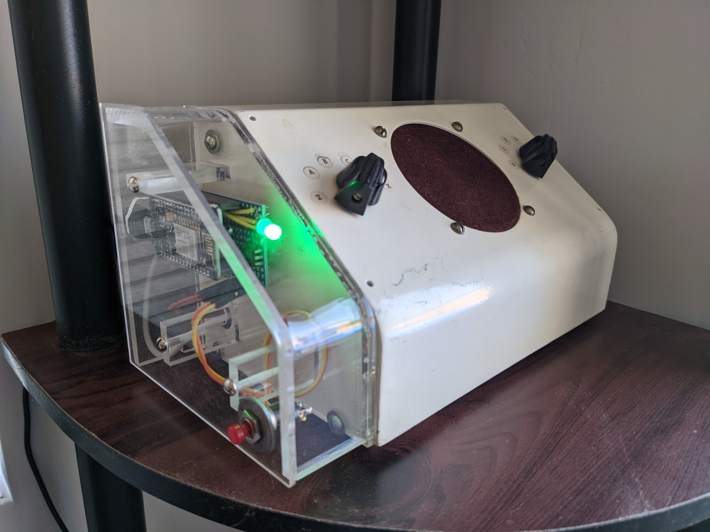

# doggie-doorbell
**PIR sensor turns on porch light and rings doorbell using Raspberry Pi and esp8266**

This describes a personal project that will alert us when our doggies (or a polite visiting neighbor dog) is waiting at our door. Lights on the porch are in a high ceiling and were controlled by an existing 3-way switch by the door. There was a Cat-6 pre-wire for a camera near the door, and no doorbell on the apartment. Hopefully what I've learned (much from others, thanks!) and shared here will help others getting started on similar projects, but I doubt it will be an exact fit for anyone else.

While everything has been stable and satisfying our needs, it is not a particularly simple implementation. A friend in Montana just mounted a cowbell by the door and trained his dogs to ring it - no batteries required! But if you are reading this you are probably interested in trying out some IoT / Home Automation solutions, and this project solved a few unique problems. Coding is roughly at a proof of concept stage and was largely stopped at the point it worked.

This was designed as a stand-alone solution and doesn't currently integrate with or depend on any Home Automation management software or Cloud services.
# Hardware

This project combines a 12V PIR (Passive InfraRed) sensor with a Raspberry Pi Zero W to detect doggies (or other warm bodies) at the door, along with an MQTT broker allowing the software to publish "light on" and "ring doorbell" messages. A Wi-Fi enabled 3-Way switch flashed with Tasmota firmware uses its MQTT client to subscribe to the "light on" message to light the porch. A separate esp8266 module subscribes to the "ring doorbell" message and activates an existing circa 1983 electronic doorbell that plays a short (think retro video games) selectable tune when a 5V pin is pulled low and released. In addition, the esp8266 module interfaces to a pushbutton switch to allow silencing the doorbell, as well as an RGB LED that indicates sound enabled (green), sound disabled (red), and doorbell triggered (flashes white).

I've provided links to most of the hardware used in the project for reference only. Links may break in future, and you should use your own judgement for where to purchase etc. I don't receive any compensation for these links. This is just what worked for me (and matches the schematics and code).

- Raspberry Pi Zero W.
    -  Many sources to order. https://www.raspberrypi.org/ for information on the Pi models.
    - This software also works fine on Raspberry Pi 4, which was used for development and initial testing.
- esp8266 NodeMCU Clone (works with Arduino IDE)
    - https://www.amazon.com/HiLetgo-Internet-Development-Wireless-Micropython/dp/B081CSJV2V/ref=sr_1_3
    - Several of the reviews (especially one pointing to https://github.com/horack/esp8266_arduino_temperature_nodes) were instrumental in helping me get this module programmed using the Arduino IDE, since the vendor supplies zero documentation.
    - I also later found https://vimalb.github.io/IoT-ESP8266-Starter/ while searching for an MQTT client, and it also contains good documentation on setting up the Arduino IDE for esp8266 development.
    - Since this module would be in a different physical location from the Raspberry Pi Zero W, I was looking for a much lower cost solution that didn't have to do much other than listen for an MQTT message and toggle an output pin. A Raspberry Pi or Arduino would have worked fine but been overkill.
- KS-602F 3 Way Smart Light Switch: https://templates.blakadder.com/KS-602F.html
    - Chose this because it could be flashed with open source https://tasmota.github.io/docs/ firmware to work with a local MQTT broker running on the Raspberry Pi. This provides the stand alone solution without needing to interface to the manufacturer's Cloud service or needing additional hardware hubs like Z-Wave and Zigbee devices (available Wi-Fi is assumed for this project).
- 12V PIR https://www.amazon.com/Security-Detector-Inductor-Floodlight-Age/dp/B00JH94X80/ref=sr_1_9
    - I chose this vs the bare PIR modules that are commonly available in starter kits because I needed an outdoor housing with the ability to adjust angle of the sensor.
    - Pictures of the enclosed board in one of the reviews allowed me to figure out how to interface this with the Raspberry Pi.
- 3.3V to 5V Shifter https://www.amazon.com/KeeYees-Channels-Converter-Bi-Directional-Shifter/dp/B07LG646VS/ref=asc_df_B07LG646VS/
    - In retrospect, a 4N35 (used this with the esp8266) might have worked as well for my application.
- 4N35 https://www.amazon.com/Fairchild-Semiconductor-4N35-Optocouplers-Phototransistor/dp/B07GN2Y3DF/ref=BDG-DBC__1
- Miscellaneous components like 1/4 W 220 Ω resistors, header pins and sockets, jumper wires, 74HC gates, etc.
- For development and final implementation: solderless breadboard, oscilloscope, DVM, adjustable power supply, soldering equipment, CH340G Serial Breakout (for flashing the KS-602F), perfboards (to solder components in final configuration), appropriate hand and power tools needed to mount things.
- Optional: saws, drill, clamps, sheet acrylic, etc. if you are building your own enclosures.
# Software
This will depend on your project. For the three major hardware components I used:
- 3 Way Smart Switch (to control porch lights)
    - https://tasmota.github.io/docs/
    - Template from https://templates.blakadder.com/KS-602F.html
    - https://github.com/espressif/esptool
- Raspberry Pi
    - https://www.raspberrypi.org/software/
    - https://mosquitto.org/ (MQTT Broker)
    - Python 3 and various libraries (see code)
    - http://mqtt-explorer.com/, https://github.com/chkr1011/MQTTnet.App, or similar for monitoring MQTT traffic / subscribing / publishing messages from GUI. Used for development and testing.
- esp8266
    - https://www.arduino.cc/en/software
    - ESP8266 Platform (see https://vimalb.github.io/IoT-ESP8266-Starter/Lesson_01/lesson.html)
    - https://pubsubclient.knolleary.net/
- Optional CAD software (used to document my schematics and cases)
    - https://www.kicad.org/
    - https://www.freecadweb.org/
- Obvious: your favorite OS, code editing, and Internet search tools.
# Methodology
Skip to the next section if you are only interested in the code and not the specific hardware choices and tweaks.

After browsing the interwebs I decided that a Wi-Fi enabled 3 Way switch to replace the one currently in the wall was the correct path, and Tasmota looked like it had good support. Although the https://templates.blakadder.com/KS-602F.html link at the time had a note about "Tuya-Convert" possibly not working (and I didn't want to interface through the manufacturer's Cloud / Smart Speakers / etc.), I decided to chance it since the Tasmota site had reasonable instructions on flashing devices using serial adapters.

All went well until I tried to flash. The default suggested tool (Tasmotizer) on https://tasmota.github.io/docs/Getting-Started/ unfortunately wouldn't connect to the KS-602F board. I tried many baud rates, lots of browsing on the Web, everything else I could think of, then pulled out the Oscilloscope. Lots of noise on the jumpers connecting the serial, so shortened the wires which helped the noise, but still no go.

To make a long story short, after many more experiments and cloning the Tasmotizer and esptool repos to compare code, I saw there were some significant differences in the current esptool and the modified fork used for Tasmotizer, so tried esptool.py out. Bingo, worked like a charm. Since my initial visit to the blakadder site, some kind person has added notes about how to flash this device to the KS-602F switch, so there should be fewer experiments as long as the underlying hardware used in the switch doesn't rev ;-).

Moral of the story I guess is things change, you have to polk around to find solutions, you may not have good docs for hacking open source firmware on to commercially available IoT devices. But searching on the Web can help. Once flashing was successful I worked on getting the PIR to flip the switch over Wi-Fi.

Following success of a "Hello World" test with the PIR module supplied in a 
Freenove starter kit for Raspberry Pi (via the Mosquitto MQTT broker), I started looking for an available PIR sensor in a weatherproof case that could be aimed from an electrical box mounted above the porch (containing Cat-6 cable routed back to a closet in the apartment where the Pi would live).

The unit I chose was rated at 12V, but I could see from photos of the board in a review that it was using common components used on the PIR module in my starter kit. These modules run at 3.3V via an onboard regulator. This turned out to be true, so I could power the PIR with 5V from the Raspberry Pi and the Red output wire would pull high to the supply (12V or 5V, tested both) when motion was detected.

I knew I had to drop this 5V to 3.3V for the input pin on the Raspberry Pi, and following some reading on DIY multi-component / transistor solutions, chose the level shifter module listed in Hardware to do the job. I also took a guess (after looking at the waveform of the output) on a pulldown resistor and picked the maximum value that would produce somewhat of a square wave. I could see from the review photo (the manufacturer's data sheet was almost worthless except to call out the color of the three wires exiting the device) that there was an electronic switch that would close on motion detection, but could not find a match for the numbers on the package so didn't know what current it would handle.

Unfortunately, this pulldown value would not produce a good 3.3V low level at the output of the level converter module to allow use with the Raspberry Pi. I solved this by running the PIR output through a gate of a 74C08 I had laying around that was happy with the output from the PIR sensor, and would drive the input of the level shifter hard enough to get a usable output. Later I decided that I could safely drop the value of the pulldown resistor to 330 Ω. This *might* have allowed me to skip the 74C08, but hey, this is a prototype and already soldered onto a perfboard, so moved on. I used a 4N35 optoisolator for a similar interface task on the esp8266 module, which might have worked just as well here. Next time I'll try that first!

Tasmota supports (encourages?) use of the MQTT protocol, so did some reading on this, picked mosquito as the broker to run on the Raspberry Pi. As an aside, I experimented with Dotnet Core on the Raspberry Pi 4, but unfortunately debugging support wasn't solid when I attempted to use it (although reading the PIR sensor worked fine). I reverted to using Python3 since it had an MQTT client and would run on Raspberry Pi Zero fine (Dotnet Core requires 64bit processors so won't run on the Zero). In addition to publishing "light on" and "ring doorbell" MQTT messages when the PIR sensed motion, I also was able to get status from the KS-602F switch to detect "manual override" by the user (this was essential to get reasonable behavior / UX in the system).

Our apartment was built without a doorbell (different story), but I had an old electronic doorbell laying around that seemed perfect. Just needed a lightweight device to subscribe to an MQTT topic and listen for the "ring doorbell" message. After searching around I chose the esp8266 module in the hardware list. Since this was my first time using the esp8266, and one of the reviewers pointed to their project (https://github.com/horack/esp8266_arduino_temperature_nodes), I decided to use this vs. many other alternatives. Horack's link had a good couple of paragraphs on using the Arduino IDE to flash this particular device (or likely any "NodeMCU 1.0 (ESP=12E Module) clone board), so I felt more confident I could get it to work. It also has a serial adapter / USB connector / 3.3V regulator, reset and flash buttons, etc. on board, which makes flashing easier and doesn't require external regulator components for use. In the future I might want to try one of the smaller modules that don't have all this, but this turned out to be an ideal board for a first-timer.

After setting up the Arduino IDE per Horack's and Arduino's instructions, and locating an MQTT client, all went smoothly. Only one major glitch after modifying the existing doorbell to run off a 15V DC wall wart vs an AC doorbell transformer; I was unable to power the esp8266 module off the 5V rail on the doorbell. So this is an example of the fun you will have putting together DIY projects ;-).

The glitch was due to the smallish 5V analog regulator chip on the original board getting too hot with the additional current demand. I tried a larger 5V analog IC and an LM296 Buck Converter module to get 5V power to the esp8266 from the 15V supply, but both solutions failed due to an apparent interaction between the 5V rail on a combined doorbell supply / esp8266 and the 12V rail running the analog amplifier chip. This caused a faint but constant and irritating "clicking" on the doorbell's speaker. Sigh... I tried more filter capacitors etc. to no avail. But an old 5V phone charger laying around powered the esp8266 module just fine, and sufficiently isolated the esp8266 from the analog amplifier in the doorbell, so all was well and I was willing to accommodate the additional wall wart to avoid completely rebuilding the doorbell 5V / 12V power circuit since the doorbell used a chip that AFAIK is no longer available or documented. If it ain't broke, don't fix it...

I did need to isolate the 3.3V esp8466 output that rings the bell from the 5V "ring" pin on the doorbell, but a 4N35 optoisolator provided a great solution and much smaller footprint than the 3.3V to 5V Shifter module I used with the Raspberry Pi. I also added a pushbutton switch to allow toggling sound on and off (for when the dogs hang out on the porch), and an RGB LED for status.

# Raspberry Pi Software
Under src/raspberrypi, contained in a single PirSense.py file (has external dependencies).

Original goal was:
- When motion detected, turn on Wi-Fi enabled porch light (via MQTT) and publish "ring doorbell" message for the third MQTT client hardware device in this system.
- Following timeout, turn light off.
- During timeout, if additional motion detected reset timeout to full length.
- Only turn on light between sunset and sunrise (don't use light sensor in PIR module since doorbell should ring 24/7).
- If light has been manually turned on when motion is detected, don't turn it off following timeout.

Hopefully the code will be self explanatory based on these goals. Nothing particularly tricky or elegant in PirSense.py, and the Mosquitto MQTT broker running on the same device is just configured using ample instructions and examples on the Web.

This was tested and debugged over a period of time both in a spare electrical box with a test light, and also with the switch installed in the wall controlling the actual porch lights. A PC was running a command line MQTT client and printed a "beep" to the console for sound while the esp8266 / doorbell solution was under development.

Aside from some debugging (I found getting my timezone logic right for the sunrise / sunset functionality the hardest part), things worked kind of as expected. But of course there were glitches.

I won't name any names, but initially the switch was not very reliable (oh no, not more X-10!). Replacing our wireless router solved that problem.

One thing I ***hadn't*** anticipated almost killed the project. There was no intuitive way to switch modes from automatic to manual if the light was initially turned on by the PIR detecting motion. The only way to reset to manual was to press the light switch to toggle off, then back on (which would set the manual override functionality).

Toggling the light manually off then back on was not an acceptable solution. This would have required you to be first the first one at the top of the stairs (oh, I didn't mention stairs, did I, and dogs are faster) and unlock the door to reach the switch before timeout. The [KISS](https://en.wikipedia.org/wiki/KISS_principle) fix was to just ***NEVER*** have the Raspberry Pi turn off the light. It will still turn on for the doggies at night, but requires the light switch (conveniently located right next to the door lol) to be pushed once the dogs are in. If you forget to do that there is always the "Toggle" button on the KF-602F web GUI. The switch, Raspberry Pi, and esp8266 all have static IPv4 addresses assigned in the wireless router to significantly simplify the design and configuration of the three hardware devices.

While I kind of miss the automatic lights off feature myself, this original software solution gave me the flexibility to modify the behavior easily without hardware changes. And although PIR floodlight fixtures allow toggling lights manually on to get a similar effect, you need to [RTFM](https://en.wikipedia.org/wiki/RTFM) to figure this out, and this (simpler hardware) solution would have the same problem with the stairs. IMHO this system works more intuitively, in addition to ringing a bespoke electronic doorbell. If you have a fully automated home, you can probably orchestrate this with the automation software and various connected devices, however I wanted a stand-alone / no Cloud solution for this project.

One thing I did anticipate was difficulty getting the PIR sensor to detect all the way to the bottom of the stairs without triggering on someone going into a garage door at the foot of the stairs. Unfortunately, I don't currently have a solution for that, but since the other existing 3 Way switch for the lights is at the bottom of the stairs, it is easy to manually turn on the lights before going up if you wish. The doggies don't care :-).

Another issue was that the PIR had a "view" of the alley beyond the stairs, causing many false "alarms"/rings as vehicles passed by. Both of these problems were mitigated by putting a baffle around the PIR sensor so it only has a view of the porch at the top of the stairs. If you have a similar application you may find the FreeCad files in CAD/PirCase a helpful starting point. Yeah, I can't spell, please don't laugh.

Oh, and since this should be resilient to a power failure, run the PirSense.py program as a service (pirsense.service). Also, since the Raspberry Pi is not connected to a keyboard / mouse / monitor in the closet (ssh when needed), see notes in RunAsService.txt on "Using systemd to turn GUI on and off" which leaves more RAM for the software (although it was getting by even with the GUI enabled).

# esp8266 Software
Arduino sketch under src/esp8266

Functionality:
- Subscribe to MQTT "ring doorbell" messages.
- Pull pin connected to the doorbell low then release (push button) when "ring doorbell" received.
- Toggle "ring doorbell" (e.g. sound) on/off with push of a function button on device case.
- Indicate sound enabled with green LED, sound disabled with red LED, and "ring doorbell" with flashing white LED (uses single RGB LED).
- Ring doorbell when function button toggles "ring doorbell" from off to on (this allows preview of the selectable tunes on the existing doorbell, controlled by two rotary switches).
    - This feature may be revised in future as the doggies now recognize the tune as "someone's at the door" :-).

This code is relatively trivial as you will see. I've already referenced a github link that will help you configure the Arduino IDE to flash the esp8266 module I chose.

# Raspberry Pi Schematic
KiCad sources under CAD/RaspberryPiSchematic. NOTE: No attempt to cross the t's and dot the i's (or do any board layout or other advanced stuff).

Note the use of three (somewhat arbitrary) pins on an RJ-45 T564-B plug to carry the 5V power, ground, and signal approximately 40 feet over CAT-6. If I ever need Ethernet at this location (single cable buried in walls) I'll need to add [PoE](https://en.wikipedia.org/wiki/Power_over_Ethernet) to the solution, as well as something to interface the PIR back into the system (perhaps an esp8266 publishing to the MQTT broker...).

# esp8266 Schematic
KiCad sources under CAD/esp8266Schematic. NOTE: No attempt to cross the t's and dot the i's (or do any board layout or other advanced stuff). And although https://github.com/KiCad/kicad-symbols/pull/1426 sadly didn't make it into KiCad, the files gave me all I needed to hack the NODE_MCU_Module.* files to match the chosen esp8266 module rather than having to recreate from scratch.

# Pictures

A few shots to give you a better idea of what the "finished" project looks like.

CH340G Serial Adapter connected to control board of disassembled KF-602F switch to flash Tasmota firmware on the device.

Weatherproof PIR sensor aimed at porch with cardboard prototype baffle to prevent false triggers. Still need to get the acrylic case made...

Raspberry Pi Zero W in closet connected to existing Cat-6 cable hijacked to provide power and signal lines leading to the PIR sensor above the porch. Pi is below the prototype board with interface components mounted.

esp8266 module attached to perfboard with LED and 4N35 mounted on side of metal (Wi-Fi proof ;) doorbell in custom acrylic case. Built-in Wi-Fi antenna on the module can be seen to the left of the LED in the photo.

